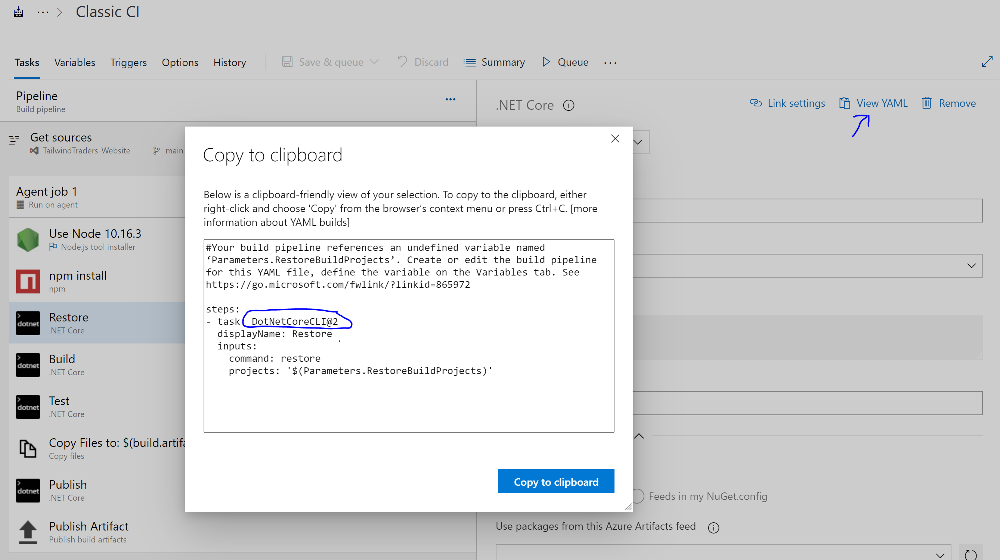

# Creating a custom mapping to override the default behavior or non existing mappings
In this lab you will create a custom plugin that transforms some of the existing migration mapping and replace it by your own mapping. 
For this you need to start coding in Ruby. 
> Useful links on Ruby: [https://www.ruby-lang.org/en/](https://www.ruby-lang.org/en/) and [https://ruby-doc.org/](https://ruby-doc.org/).

## Creating a custom mapping
To create a mapping, you need to create a Ruby file that looks as follows:
``` ruby
transform "azuredevopstaskname" do |item|
   # your ruby code here that produces output
  end
```  
Create a new Folder with the name plugin and create the new file in that folder.

If we look at the transformation that was generated for our CI pipeline, we have seen the transformation does not take into account the fact we specified a wildcard pattern to match any of the csproj files we might have in our repo. This now results in a workflow that fails the build if we accept the default mapping.

Let's see if we can fix this by providing an alternative.

We start by changing the function name to match the Azure DevOps task name `DotNetCoreCLI@2`.
The way you find this name is by clicking the view yaml button at a task in the pipeline:


This results int he following code:
``` ruby
transform "DotNetCoreCLI@2" do |item|
   # your ruby code here that produces output
  end
```  
The parameter item is a collection of items than contain the properties of the original task that was retrieved from Azure DevOps.
In our case we can see in the yaml the properties that are set are e.g. `command` and `projects`.

This is what you can expect to find when we would dump the information. The way you can figure out what is in the item being passed you can do the following:
``` ruby
transform "DotNetCoreCLI@2" do |item|
   puts item
  end
```  
And then run a valet command line where we pass in the custom mapping like this:
> `$ valet migrate azure-devops pipeline --target-url https://github.com/Microsoft-Bootcamp/<yourreponame> --pipeline-id ### --custom-transformers plugin/DotNetCoreCLI.rb `

the output will show the following:
<pre> 
[2021-09-14 21:40:04] Logs: 'log/valet-20210914-214004.log'                                                                     
WARNING: `Faraday::Connection#basic_auth` is deprecated; it will be removed in version 2.0.                                     
While initializing your connection, use `#request(:basic_auth, ...)` instead.
See https://lostisland.github.io/faraday/middleware/authentication for more usage info.<b>
{"command"=>"restore", "projects"=>"$(BuildParameters.RestoreBuildProjects)"}                                                   
{"projects"=>"$(BuildParameters.RestoreBuildProjects)", "arguments"=>"--configuration $(BuildConfiguration)"}
{"command"=>"test", "projects"=>"$(BuildParameters.TestProjects)", "arguments"=>"--configuration $(BuildConfiguration)"}
{"command"=>"publish", "publishWebProjects"=>true, "projects"=>"$(BuildParameters.RestoreBuildProjects)", "arguments"=>"--configuration $(BuildConfiguration) --output $(build.artifactstagingdirectory)", "zipAfterPublish"=>true}</b>
WARNING: `Faraday::Connection#authorization` is deprecated; it will be removed in version 2.0.                                  
While initializing your connection, use `#request(:authorization, ...)` instead.
See https://lostisland.github.io/faraday/middleware/authentication for more usage info.
[2021-09-14 21:40:08] Pull request: 'https://github.com/Microsoft-Bootcamp/test/pull/16'                                        
</pre>

Note the bold output, that is the result of our `puts item` statement.

Now that we know what we can expect in the item argument, lets see how we can change the output that now defaults to the use of the run command.

Lets make a code change to the ruby file and change it to this:
``` Ruby
transform "DotNetCoreCLI@2" do |item|
  projects = item["projects"]
  command = item['command']
  run_command = []
  
        if(projects.include?("$"))
          if(command.nil?)
            command = "build"
          end
           run_command << "shopt -s globstar; for f in ./**/*.csproj; do dotnet #{command} $f #{item['arguments'] } ; done"
        else
            run_command << "dotnet #{command} #{item['projects']} #{item['arguments'] }"
       end 
    {
      shell: "bash",
      run: run_command.join("\n")
    }
end
```
Now run the transformation again and pass it the custom plugin.

Now look at the result and see if this results in a build that succeeds.


