# Setting up Code Scanning and Security Scanning for your repository
This hands-on lab has the goal to show you how you can set up Code Scanning for your repository and to let you experience how its features help you to find security vulnerabilities and code errors in the code in your repository. Secondly, you will learn how to enable Secret Scanning and will experience how it is able to scan your respository for known types of secrets and what it's capabilities are in order to prevent fraudelent use.

## Enabling GitHub Advanced Security on your repository
Should GitHub Advanced Security not be enabled yet on your repository, you can enable it from the `Settings` menu on your repository, then under `Security & Analysis`, in the section `GitHub Advanced Security`, click `Enable`. Advanced Security should be enabled in order to enable Code Scanning and Secret Scanning.

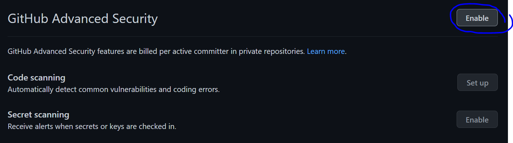

### More on Code Scanning
Code scanning is a feature that you use to analyze the code in a GitHub repository to find security vulnerabilities and coding errors. Any problems identified by the analysis are shown in GitHub.

You can use code scanning to find, triage, and prioritize fixes for existing problems in your code. Code scanning also prevents developers from introducing new problems. You can schedule scans for specific days and times, or trigger scans when a specific event occurs in the repository, such as a push. If code scanning finds a potential vulnerability or error in your code, GitHub displays an alert in the repository. After you fix the code that triggered the alert, GitHub closes the alert. For more information, see [Managing code scanning alerts for your repository](https://docs.github.com/en/code-security/secure-coding/managing-code-scanning-alerts-for-your-repository]).

For GitHub Code Scanning documentation, please refer to: [https://docs.github.com/en/code-security/code-scanning/automatically-scanning-your-code-for-vulnerabilities-and-errors/about-code-scanning](https://docs.github.com/en/code-security/code-scanning/automatically-scanning-your-code-for-vulnerabilities-and-errors/about-code-scanning)

### More on Secret Scanning
If your project communicates with an external service, you might use a token or private key for authentication. Tokens and private keys are examples of secrets that a service provider can issue. If you check a secret into a repository, anyone who has read access to the repository can use the secret to access the external service with your privileges. We recommend that you store secrets in a dedicated, secure location outside of the repository for your project.

Secret scanning will scan your entire Git history on all branches present in your GitHub repository for any secrets. Service providers can partner with GitHub to provide their secret formats for scanning. For more information, see "Secret scanning partner program."

If someone checks a secret with a known pattern into a public or private repository on GitHub, secret scanning catches the secret as it's checked in, and helps you mitigate the impact of the leak. Repository administrators are notified about any that contains a secret, and they can quickly view all detected secrets in the Security tab for the repository.

For GitHub Secret SCanning documentation, please refer to: [https://docs.github.com/en/code-security/secret-scanning/about-secret-scanning](https://docs.github.com/en/code-security/secret-scanning/about-secret-scanning)

## Code Scanning
### Enabling the Code Scanning functionality
To enable GitHub Code Scanning, please navigate to the `Settings` of your repository, click `Security & analysis` click `Set up` for the `Code Scanning` feature.

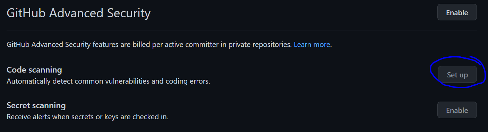

You'll be directed to the `Get started with Code Scanning` form, from where you can set up code scanning to use the CodeQL product maintained by GitHub or a third-party code scanning tool. For this lab, we'll pick the CodeQL product. To enable this, you'll click the `Set up this workflow` for the `CodeQL Analysis` product maintened by Github.

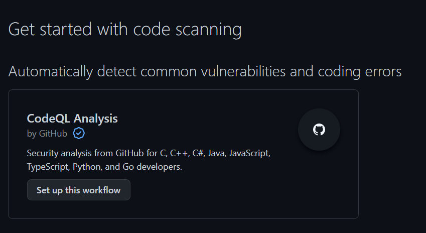

After this step, a `codeql-analysis.yml` file is generated for you. For most projects, this workflow file will not need changing; you simply need to commit it to your repository. 

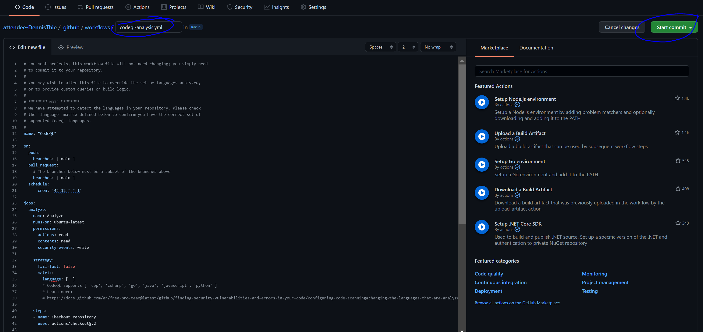

Once you have commited your changes, you will see the `codeql-analysis.yml` file in the new directory `./github/workflows`.

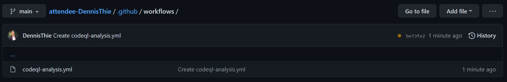

When you click the file `codeql-analysis.yml`, you get to see the option `View runs`. 

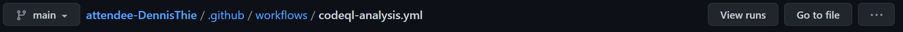

From here, you can see the list of workflows with the CodeQL workflow and the run history of the CodeQL workflow. In the default CodeQL analysis workflow, code scanning is configured to analyze your code each time you either push a change to the default branch or any protected branches, or raise a pull request against the default branch. As a result, code scanning will now commence. As you can see on the below screenshot, the workflow is currently running.

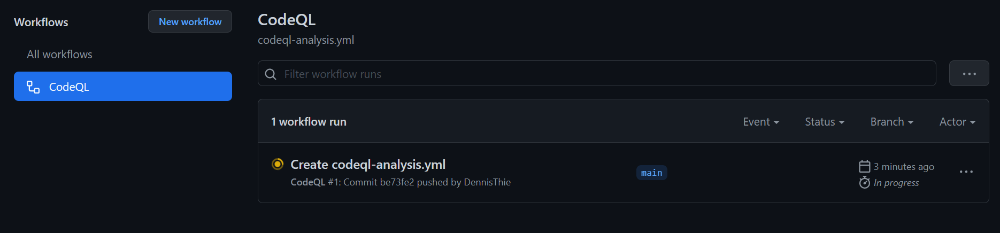

After some minutes, the workflow run will be completed and you will see the status being updated.

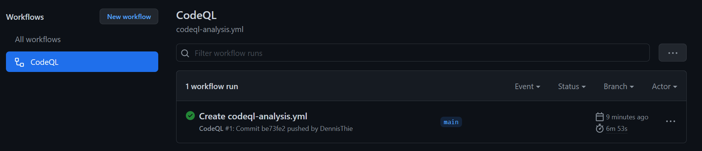

Clicking through on the workflow run, by clicking on `Create codeql-analysis.yml`, you can see the details of the workflow run. 

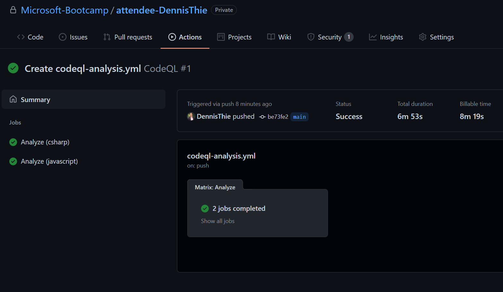

Great, now that your CodeQL workflow is completed, we can move on and discover the way your Code Scanning outcomes can be analyzed. 

### Analyzing Code Scanning outcomes
When you navigate to the `Security` tab on your repository, and click `Code Scanning alerts`, you can see the active alerts for Code Scanning. From this view, you can view, fix, dismiss, or delete alerts for potential vulnerabilities or errors in your project's code.

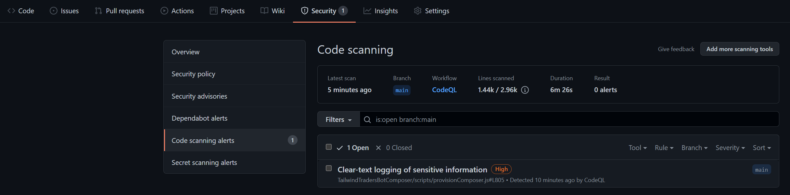

Each alert highlights a problem with the code and the name of the tool that identified it. You can see the line of code that triggered the alert, as well as properties of the alert, such as the severity, security severity, and the nature of the problem. Alerts also tell you when the issue was first introduced. For alerts identified by CodeQL analysis, you will also see information on how to fix the problem.

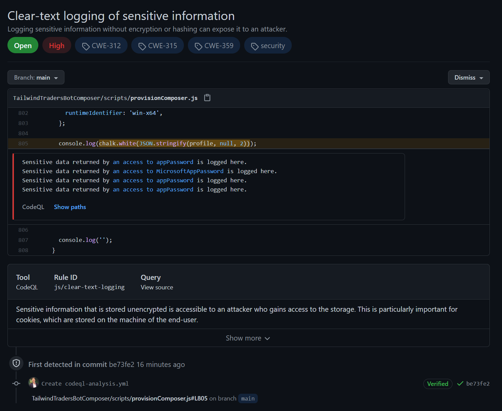

For more detailed information on managing the Code Scanning alerts, refer to: [https://docs.github.com/en/code-security/code-scanning/automatically-scanning-your-code-for-vulnerabilities-and-errors/managing-code-scanning-alerts-for-your-repository](https://docs.github.com/en/code-security/code-scanning/automatically-scanning-your-code-for-vulnerabilities-and-errors/managing-code-scanning-alerts-for-your-repository)

## Secret Scanning 
### Enabling Secret Scaning functionality
To enable GitHub Secret Scanning, please navigate to the `Settings` of your repository, click `Security & analysis` click `Enable` for the `Secret Scanning` feature.

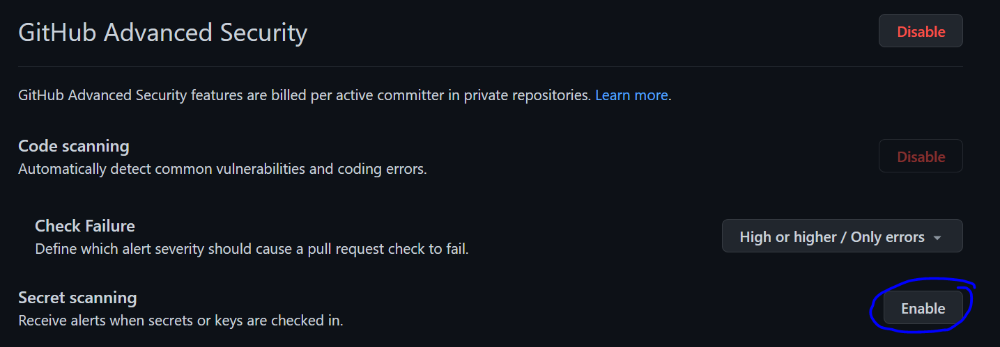

Secret Scanning is now enabled for your repository. 

GitHub performs secret scanning on public and private repositories for secret patterns provided by GitHub and GitHub partners. However, there can be situations where you want to scan for other secret patterns in your private repositories. For example, you might have a secret pattern that is internal to your organization. For these situations, you can define custom secret scanning patterns in your enterprise, organization, or private repository on GitHub.

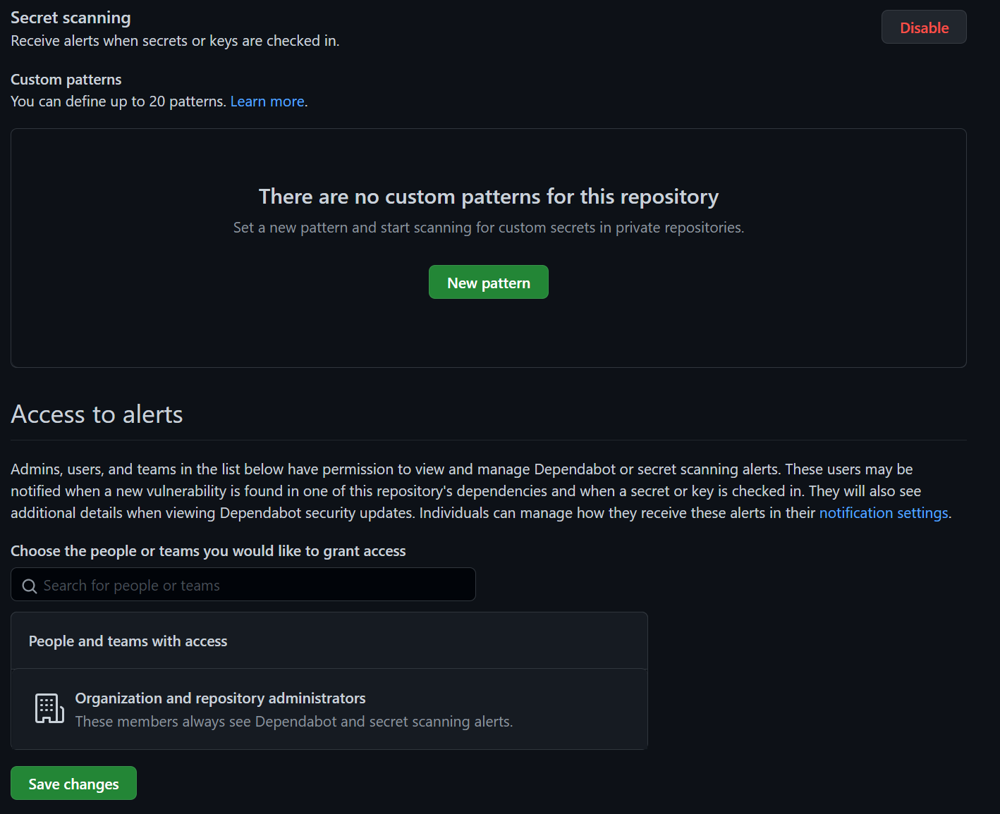

You can define up to 20 custom patterns for each private repository, organization, or enterprise account and options to define these are enabled after you enable the `Secret Scanning` feature in your `Security & analysis` settings. We'll not go into the custom patterns in this lab, but for more information refer to: [https://docs.github.com/en/code-security/secret-scanning/defining-custom-patterns-for-secret-scanning](https://docs.github.com/en/code-security/secret-scanning/defining-custom-patterns-for-secret-scanning)

### Triggering Secret Scanning by inserting a connection string

### Analyzing Secret Scanning alerts/warnings
