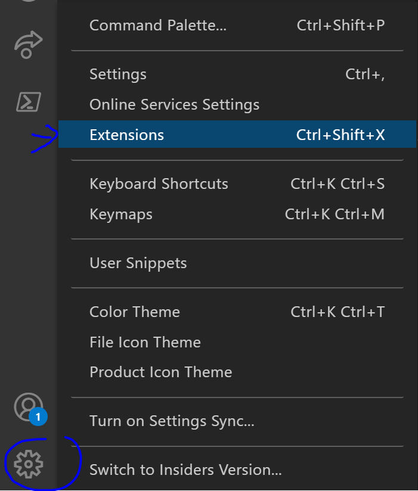
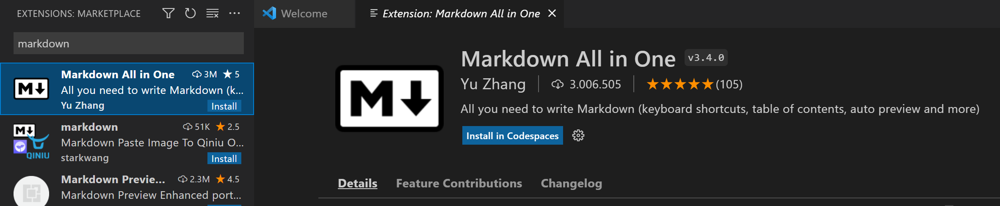

# Using Code Spaces on your repository
During this Technical Bootcamp, you have already had some hands-on experience working with Code Spaces. In this hands-on lab, we'll dive a bit deeper and have the goal to have you  extend your Code Spaces installation with a plugin you not already have installed. 

Navigate to your Code Space. If you have not yet started your Code Space, from your repository on the tab `Code`, click the `Code` button, select `Code Spaces` and `New codespace`.

Go to `Settings` (located on the bottem left side of your screen) and select `Extensions` 

Search for the term "markdown" and select the "Markdown all in one" extension.

Do not click `Install in Codespaces`, as this will only install the extension for now. Instead, click the wheel and select `Add to devcontainer.json`. 

You'll get a pop-up stating "We've noticed a change to the devcontainer configuration. Rebuild the container to apply them now". So, you will need to rebuild the container. Therefore, you navigate to the `devcontainer.json` file, click on the `...` and click `Build`.

Great job. :thumbsup: You've now added an extension to the Code Spaces container in a way that will ensure this extension is always available when you open your Code Space. 
