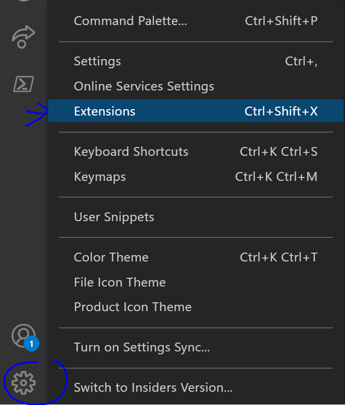
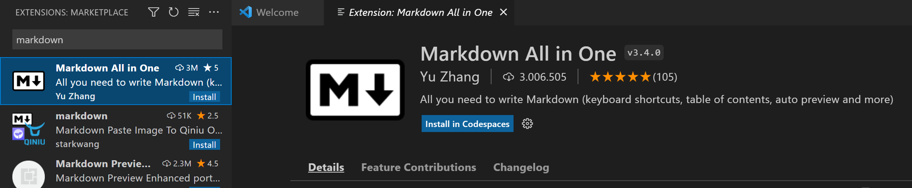
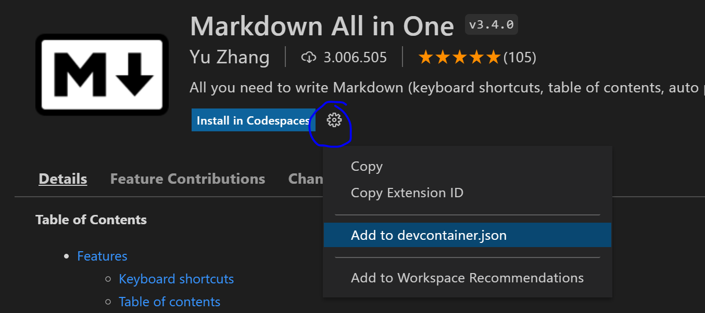
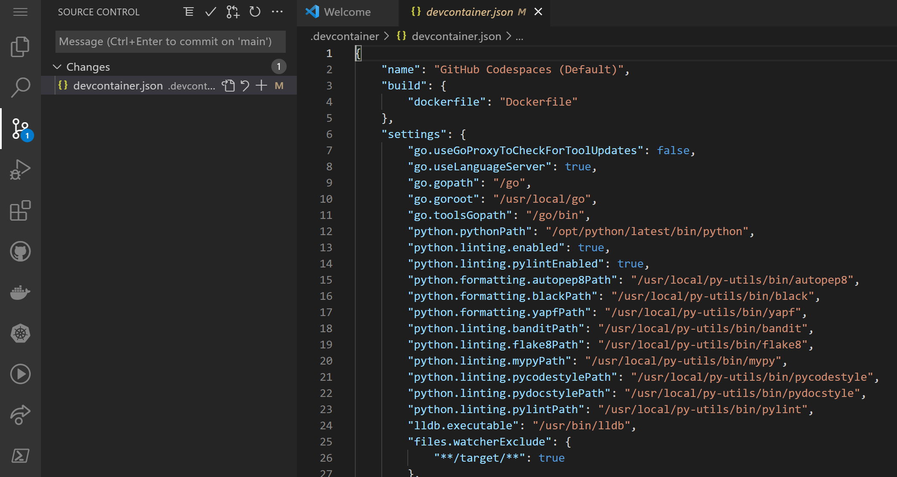

# 2.4 Using Code Spaces on your repository
During this Technical Bootcamp, you have already had some hands-on experience working with Code Spaces. In this hands-on lab, we'll dive a bit deeper and have the goal to have you  extend your Code Spaces installation with an extension you not already have installed. We will add this extension in a way that makes the extension persistent, meaning that when you start your CodeSpaces environment the next time you use it, the extension will also be loaded. This hands on lab will allow you to further experience the benefits of working with Code Spaces.

Navigate to your Code Space. If you have not yet started your Code Space, from your repository on the tab `Code`, click the `Code` button, select `Code Spaces` and `New codespace`. Once you are in your Code Space, you can follow the next steps to add an extension to your Code Space.

Go to `Settings` (located on the bottem left side of your screen) and select `Extensions` 

Search for the term "*markdown*" and select the "*Markdown all in one*" extension.

Do not click `Install in Codespaces`, as this will only install the extension for now. Instead, click the settings wheel and select `Add to devcontainer.json`. 

You'll get a pop-up stating "*We've noticed a change to the devcontainer configuration. Rebuild the container to apply them now*". So, you will need to rebuild the container. 
Click on the `Rebuild now` option on the pop-up. If you missed this, you can ofcourse still manually start a rebuild. Open the Command Palette (ctrl-shift-p/cmd-shift-p) in your Codespace and type "*Rebuild Codespace*". [More information can be found here](https://docs.github.com/en/codespaces/customizing-your-codespace/configuring-codespaces-for-your-project#applying-changes-to-your-configuration).

Great job! :thumbsup: You've now added an extension to the Code Spaces container in a way that will ensure this extension is always available when you open your Code Space. So, next time you open your Code Space - this extension will be available without any manual intervention.
