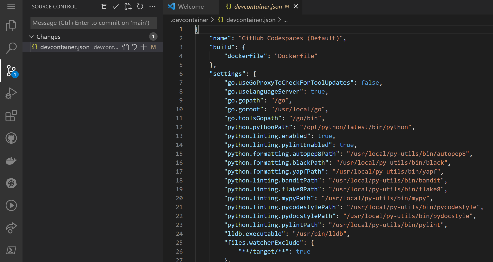

# 1. Setting up Codespaces to develop a web-app

During this GitHub Code To Cloud Workshop, you will use CodeSpaces as your development IDE in the cloud. For more information on Codespaces, visit: [https://github.com/features/codespaces](https://github.com/features/codespaces)

In this hands-on lab, we'll prepare your Codespaces environment and configure it to allow you to develop a web-app. 
This hands-on lab introduces you to the concept of Codespaces, working with Codespaces and prepares your Codespaces environment for the subsequent hands-on labs. where you will further experience the benefits of working with CodeSpaces.

## 1.1 Starting you Codespaces environment
1. If you have not yet started your Code Space, from your repository on the tab `Code`, click the `Code` button, select `Code Spaces` and `New codespace`. Once you are in your Code Space, you can follow the next steps to add an extension to your Code Space.

## 1.2 Adding [u]persistent[/u] Extensions to your Codespaces environment

1. Go to `Settings` (located on the bottem left side of your screen) and select `Extensions` 

2. Search for the term "*markdown*" and select the "*Markdown all in one*" extension.

3. Do not click `Install in Codespaces`, as this will only install the extension for now. Instead, click the settings wheel and select `Add to devcontainer.json`. 

4. You'll get a pop-up stating "*We've noticed a change to the devcontainer configuration. Rebuild the container to apply them now*". So, you will need to rebuild the container. 

Click on the `Rebuild now` option on the pop-up. If you missed this, you can ofcourse still manually start a rebuild. Open the Command Palette (ctrl-shift-p/cmd-shift-p) in your Codespace and type "*Rebuild Codespace*". [More information can be found here](https://docs.github.com/en/codespaces/customizing-your-codespace/configuring-codespaces-for-your-project#applying-changes-to-your-configuration).

Great job! :thumbsup: You've now added an extension to the Code Spaces container in a way that will ensure this extension is always available when you open your Code Space. So, next time you open your Code Space - this extension will be available without any manual intervention.
