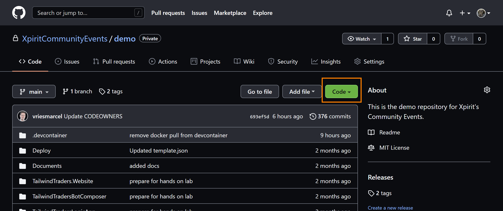
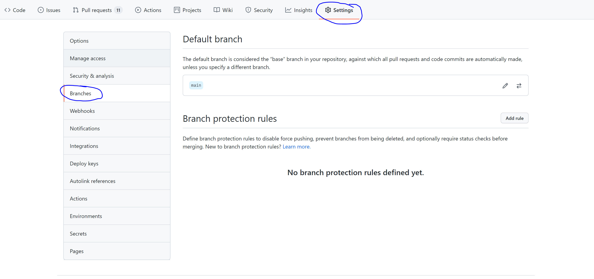
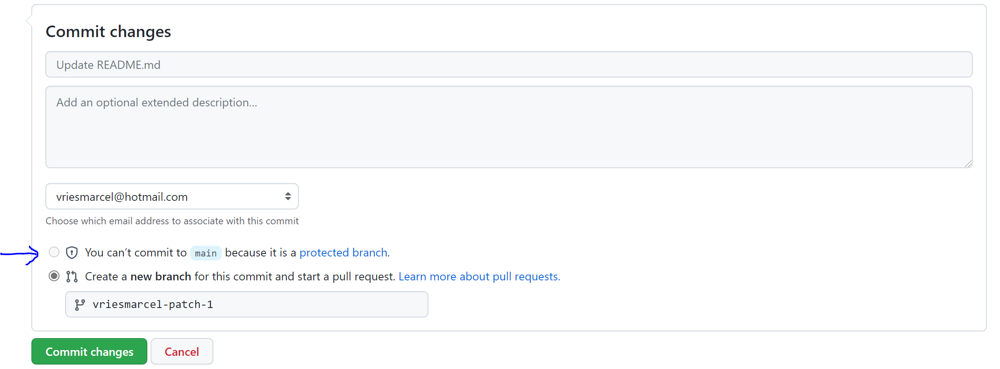

# 1. Import an existing repository to GitHub

## Objectives of this hands-on lab
This hands-on lab has the objective to show you how you can migrate an existing git repository to GitHub. At the end of this hands-on lab, your GitHub repository (`https://github.com/XpiritCommunityEvents/attendee-<yourGitHubhandle>`) will contain a migrated copy of an existing repository that we have prepared for this exercise. This is the first step that needs to be finished for all the other labs to succeed, as you will use this repository to perform the other hands-on labs. Good luck! 👍

This hands-on lab consists of the following steps:
- [1.1 Acquiring the repository URI](#11-acquiring-the-azure-devops-git-repository-uri)
- [1.2 Import the repository using the command-line](#12-Import-the-repository-using-the-command-line)
- [1.3 Create a Branch Rule](#15-create-a-branch-rule)
- [If time permits: enforce CODEOWNERS review](#if-time-permits-enforce-codeowners-review)

### 1.1 Acquiring the Azure DevOps Git repository URI
For this bootcamp, we have prepared a repository for you and created a private GitHub repository for you. Before you can clone the existing repository, you'll need an URI that points to the existing repository. This URI represents the source of the repo you're going to copy. 

**For this bootcamp, please use the following clone URL: [https://github.com/XpiritCommunityEvents/demo](https://github.com/XpiritCommunityEvents/demo)**

Start with retrieving the Clone URL of the Azure DevOps repository you want to migrate.
1. From your web browser, open the GitHub page for this repository and select the green `code` button.



2.Copy the clone URI into the clipboard or store it in a place where you can find it easily. You can't clone a repo without a clone URL. Choose HTTPS (default) or SSH for the authentication, depending on your preference. If you are not familiar with this, then choose HTTPS. 

### 1.2 Import the repository using the command-line

In this step, you clone the repository locally, then push it into GitHub. This requires the Git client, which you can [download here](https://git-scm.com/download/gui/windows).

Start a command prompt and move to a location where you want to clone the repo on your machine, e.g. `c:\sources`. 

Enter the following command and make sure you read the [Authentication](#authentication) part below.

``` powershell
git clone [PASTE_CLONE_URL_HERE] 
```

#### Authentication
Since we are using a `Private` repository, you need to authenticate your session. If you have installed Git for Windows with the Credential Manager option, this information will be stored on your machine after authenticating for the first time. 

For the authentication you can either use SSH or HTTPS. 

##### HTTPS Authentication
If you are using HTTPS then you need to create a Personal Access Token (PAT). Go to [https://github.com/settings/tokens](https://github.com/settings/tokens) to create one. Give it the `Full control of private repositories` scope and a meaningful note. Store the token somewhere safe, it will only be visible once!  

The username in the authentication prompt can be anything, since it will not be used. For the password: enter the PAT.

##### SSH Authentication
For SSH authentication you need to add your public key by going to [https://github.com/settings/keys](https://github.com/settings/keys).


### Push to attendee repository 
Now we have a cloned repository with the full history on your local drive. Next, we want to move this repo with the history to the GitHub repo that is available for you.
You should have access to a GitHub Repo in the organization [https://github.com/XpiritCommunityEvents](https://github.com/XpiritCommunityEvents). This repo has the name `attendee-<your-github-handle>`

Now, we'll change the remote to your GitHub repository. To achieve this, you use these commands: 

``` powershell
cd demo
git remote remove origin
git remote add origin {your personal repo clone uri}
```

So, your command would look something like `git remote add origin https://github.com/XpiritCommunityEvents/attendee-<your-github-handle>.git`

Now we are ready to push the complete repo, including it's history, branches and tags to the GitHub repo.
For this you can use the command:

``` powershell
git push origin
```

> NOTE: In case you had already initialized your repo over on GitHub, you can force the code into the repo by adding `-f`. **This will overwrite your repository and its contents!**
> 
> ``` powershell
> git push -f origin
> ```

The repository is now migrated to your GitHub repo with full history. 

### 1.5 Create a Branch Rule
By now your repository at GitHub has content and we can protect our branches against unwanted direct updates. This is a very common setup in the enterprise.
In this excursive we will create a branch rule that prevents you to commit to the main branch direct and require you to create a pull request.

In your GitHub repo go to the settings tab and click the branches option as shown here:



Now add a new rule and define which branch you want to protect. e.g. provide the pattern name `main`
Next you select the following options:
1. `Require pull request reviews before merging`
2. `Include administrators`

Now save this Branch Rule and see if it works.

#### Verify
To check if it works, create a change on one of the files that is in the main branch. Just use the portal to make the change and verify that the moment you want to commit the change you see the below indicator that you need to create a new branch before you can commit:



Now, create a new branch and create a pull request that enables the code review from someone else in your organization/repository.

# If time permits: enforce CODEOWNERS review

If you want to enforce certain teams can only approve parts of the codebase, like a web development team for all the web application code and a docs team for the documentation, you can use the code owners file. We can enforce the code owners need to be part of the review process by adding this to the Branch Protection Rule.
There is already a CODEOWNERS file in the repo that you migrated. It has the following contents:

```
# Example, any change in this repo 
# will require approval from workshopowners team
* @XpiritCommunityEvents/workshopowners

# Any change inside the `/Documents` directory
# will require approval from anyone in the organization fluentbytes and the team docsteam
/Documents @XpiritCommunityEvents/reviewers
# Create your own rules below this line without the # sign
```
Now change the file so it defines the folder `/TailwindTraders.Website/Source/Tailwind.Traders.Web` has a team as owner. All attendees of todays technical workshop are part of a team that we set up. this team has the following naming convention: Attendees_ddMM where dd stands for the day of the month of the workshop (with leading 0 so it is always two digits) and MM stands for the month number. So October 6 is then: `@XpiritCommunityEvents/Attendees_0610`. The Team must have access to your repository, add them with "Write" permissions so they can review your code.

After setting up the file, commit it to the main branch (use a Pull Request!). Next go to the branch protection rules and for the main branch select the option `Require review from Code Owners`

Save the branch protection rule and make a change to e.g. the startup.cs file and see if you can commit the changes to the main branch. Ask one of the other attendees to review the pull request you created and see if it then is allowed to approve and merge the pull request. Please use the teams chat to find a colleague who can approve your pull request. If you can't find anyone, ask the instructors. 
