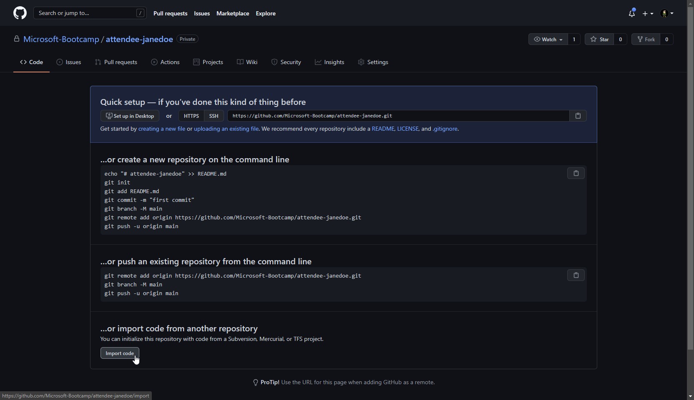
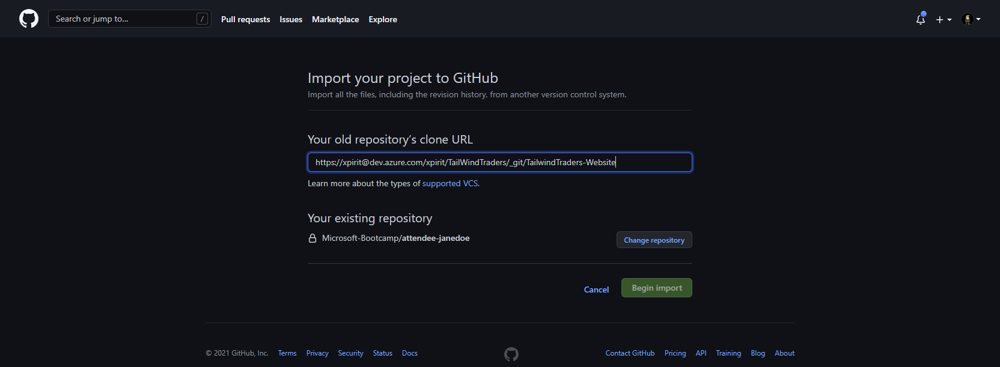
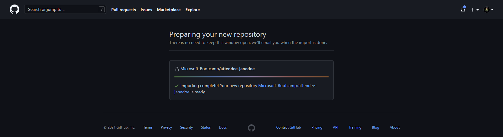

# 1. Migrating a repository from Azure DevOps to GitHub

## Objectives of this hands-on lab
This hands-on lab has the objective to show you how you can migrate an existing Azure DevOps git repository to GitHub. At the end of this hands on lab, your GitHub repository (`https://github.com/XpiritCommunityEvents/attendee-<yourGitHubhandle>`) will contain a migrated copy of an Azure DevOps repository that we have prepared for this exercise. This is the first step that needs to be finished for all the other labs to succeed, as you will use this repository to perform the other hands on labs. Good luck! 👍

This hands on lab consists of the following steps:
- [Acquire the Azure DevOps Git repository URI](#acquire-the-azure-devops-git-repository-uri)
- [Import the repository](#import-the-repository)
- [Clone the repository - Using command line](#clone-the-repository---using-command-line)
- [Import the repository - Using GUI](#import-the-repository---using-gui) (optional)
- [Create a Branch Rule](#create-a-branch-rule)
- [If time permits: enforce CODEOWNERS review](if-time-permits-enforce-codeowners-review)

### 1.1 Acquire the Azure DevOps Git repository URI
For this bootcamp, we have prepared a public Azure DevOps repository for you and created a private GitHub repository for you. Before you can clone the existing repository, you'll need an URI that points to the existing repository. This URI represents the source of the repo you're going to copy. 

**For this bootcamp, please use the following URL: [https://dev.azure.com/xpirit/TailWindTraders](https://dev.azure.com/xpirit/TailWindTraders)**

Start with retrieving the Clone URL of the Azure DevOps repository you want to migrate.
1. From your web browser, open the team project for your Azure DevOps organization and choose `Repos`, then `Files`.


2. Select `Clone` in the upper right. Copy this URL into the clipboard or store it in a place where you can find it easily. You can't clone a repo without a clone URL.

 

### 1.2 Import the repository
Next, we'll import the Azure DevOps repository in your GitHub repository. There are two ways to achieve this, you'll use one of both: 
1. [Clone the repository  - Using command line](#clone-the-repository---using-command-line)
2. [Import the repository - Using GUI](#import-the-repository---using-gui)

### 1.3 Clone the repository - Using command line
In this step, you clone the repository locally, then push it into GitHub. This requires the Git client, which you can [download here](https://git-scm.com/download/gui/windows).

Start a command prompt and move to a location where you want to clone the repo on your machine, e.g. `c:\sources`. 

Enter the following command 

```
git clone --mirror [PASTE_AZURE_DEVOPS_REPO_URL_HERE] 
```

Now we have a cloned repository with the full history on your local drive. Next, we want to move this repo with the history to the GitHub repo that is available for you.
You should have access to a GitHub Repo in the organization https://github.com/Microsoft-Bootcamp. This repo has the name `attendee-<your-github-handle>`

Now, we'll change the remote to your GitHub repository. To achieve this, you use the command 

```
cd TailwindTraders-Website.git
git remote add github {your clone url}
```

So, your command would look something like `git remote add github https://github.com/Microsoft-Bootcamp/attendee-<your-github-handle>.git`

Now we are ready to push the complete repo, including it's history, branches and tags to the GitHub repo.
For this you can use the command:

```
git push --mirror github
```

> NOTE: In case you had already initialized your repo over on GitHub, you can force the code into the repo by adding `-f`. **This will overwrite your repository and its contents!**
> 
> ```
> git push --mirror -f github
> ```

The repository is now migrated from Azure DevOps to GitHub with full history. In the next part of the bootcamp, we'll look at what is migrated, and what we are missing after the migration.

As you may have noticed the mirror clone did not contain a working folder with the main branch checked out. If you want to have a local working copy, you'll have to create a new clone that isn't a bare/mirror-clone. The simplest solution in our case is to simply delete the `TailwindTraders-Website.git` directory and clone the repository again:

```
git clone https://github.com/Microsoft-Bootcamp/attendee-<your-github-handle>.git
```

You can now skip directly to [Create a Branch Rule](#create-a-branch-rule).

### 1.4 Import the repository - Using GUI
>**Note: This section is purely informational. If you have already cloned your repository using the steps above, skip this section because this functionality is only available in a completely empty repository. This section describes how you can import the Azure DevOps repository into your GitHub repository using GUI with the Import Code functionality. Importing using the GUI will not work for you if you have initialized your repository with a commit. If this is the case, perform the import using the steps documented: [Clone the repository  - Using command line](#clone-the-repository---using-command-line).

Navigate to your repository on GitHub, it should still be completely empty and offer the ability to `Import Code` at the bottom of the page:

 

The next screen will prompt you for the source to import. Use the clone URL for the Azure DevOps Repository you copied in the previous step:



Verify that you've selected the correct target repository and click `begin import`.

GitHub will now automatically import and optimize the repository and should finish in a moment:



Now clone your repository to your local machine with the CLI or with your favorite git client:

```
git clone https://github.com/Microsoft-Bootcamp/attendee-<your-github-handle>.git
```

You can now skip directly to [Create a Branch Rule](#create-a-branch-rule).

### 1.5 Create a Branch Rule
By now your repository at GitHub has content and we can now protecting our branches against unwanted direct updates. This is a very common setup in the enterprise.
In this excursive we will create a branch rule that prevents you to commit to the main branch direct and require you to create a pull request.

In your GitHub repo go to the settings tab and click the branches option as shown here:


Now add a new rule and define which branch you want to protect. e.g. provide the pattern name `main`
Next you select the following options:
1. `Require pull request reviews before merging`
2. `Include administrators`

Now save this Branch Rule and see if it works.

To check if it works, create a change on one of the files that is in the main branch. Just use the portal to make the change and verify that the moment you want to commit the change you see the below indicator that you need to create a new branch before you can commit:


Now, create a new branch and create a pull request that enables the code review from someone else in your organization/repository.

# If time permits: enforce CODEOWNERS review

If you want to enforce certain teams can only approve parts of the codebase, like a web development team for all the web application code and a docs team for the documentation, you can use the code owners file. We can enforce the code owners need to be part of the review process by adding this to the Branch Protection Rule.
There is already a CODEOWNERS file in the repo that you migrated. It has the following contents:

```
# Example, any change in this repo 
# will require approval from @vriesmarcel
# * @vriesmarcel

# Any change inside the `/Documents` directory
# will require approval from anyone in the organization fluentbytes and the team docsteam
# /Documents @XpiritCommunityEvents/reviewers
# Create your own rules below this line without the # sign
```
Now change the file so it defines the folder `/TailwindTraders.Website/Source/Tailwind.Traders.Web` has a team as owner. All attendees of todays technical workshop are part of a team that we set up. this team has the following naming convention: Attendees_ddMM where dd stands for the day of the month of the workshop (with leading 0 so it is always two digits) and MM stands for the month number. So October 6 is then: `@Microsoft-Bootcamp/Attendees_0610`. The Team must have access to your repository, add them with "Write" permissions so they can review your code.

After setting up the file, commit it to the main branch.
Next go to the branch protection rules and for the main branch select the option `Require review from Code Owners`

Save the branch protection rule and make a change to e.g. the startup.cs file and see if you can commit the changes to the main branch. Ask one of the other attendees to review the pull request you created and see if it then is allowed to approve and merge the pull request. Please use the teams chat to find a colleague who can approve your pull request. If you can't find anyone, ask the instructors. 
