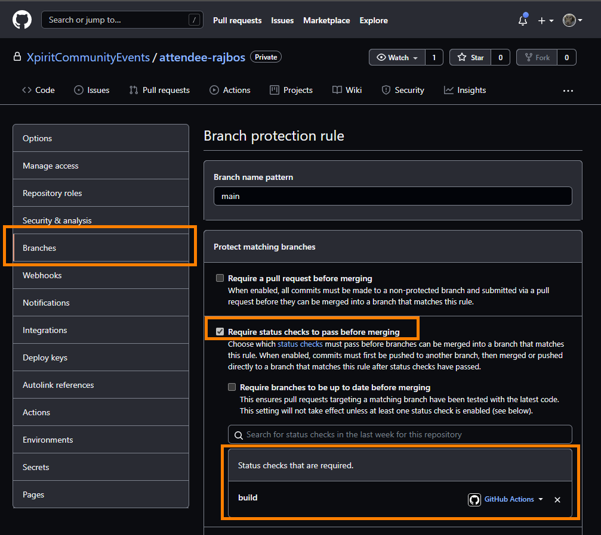

# 4. Creating a .NET Actions workflow

## Objectives of this hands-on lab
Let's use the power of GitHub Actions to create a Continuous Integration workflow for our .NET Core project. With Continuous Integration, we can ensure that our project is ready to be deployed to production by building it each time code changes are pushed to the GitHub repo.

This hands on lab consists of the following steps:
- [3.1 Create a Continuous Integration workflow](#31-create-a-continuous-integration-workflow)
- [3.2 Use parameters in the workflow](#32-use-parameters-in-the-workflow)
- [3.3 Create a check workflow for a Pull Request](#33-create-a-check-workflow-for-a-pull-request)
- [3.4 Extract a .NET template for reuse](#34-extract-a-dotnet-template-for-reuse)
- [3.5 If time permits: Deploy to the cloud](#if-time-permits-deploy-to-the-cloud)

### 3.1 Create a Continuous Integration workflow
The goal of implementing Continuous Integration is to build our application whenever someone pushed their code changes to the GitHub repo. That way we create a fast feedback cycle and verify that the incoming code changes actually can be build on a different machine then the one from the developer that made the changes. This prevents the issue of 'works on my machine'. Inside the Continuous Integration workflow, we can also build in more checks to verify that our software still works as expected or check for security issues.

Let's start by creating a new GitHub Actions workflow and name it `ci build.yml`. Don't forget to store the workflow in the `.github/workflows` folder.

The basic structure of a GitHub Actions workflow is as follows:
```YAML
on:
  push:
    branches: [ main ]
  pull_request:
    branches: [ main ]

jobs:
  build:
    runs-on: ubuntu-latest
    steps:
    - uses: actions/checkout@v2
```
Commit the workflow and verify that it runs correctly.

#### Install correct version of node and .NET tooling
To be able to run the correct versions of node and .NET, we can install those tools at runtime using the `actions/setup-node@v1` and `actions/setup-dotnet@v1` steps. Add these to your workflow:

```YAML
- name: Setup .NET
  uses: actions/setup-dotnet@v1
  with:
    dotnet-version: 5.0.x
 - name: Use Node 10.16.3
   uses: actions/setup-node@v2
   with:
     node-version: 10.16.3
```
Commit the workflow and verify that it runs correctly.

#### Add the build commands
To run the .NET commands we can use shell commands. Note that we need to tell .NET where to find the project to run:
```YAML
- run: npm install
  working-directory: TailwindTraders.Website/Source/Tailwind.Traders.Web/ClientApp
- name: Restore dependencies
  run: dotnet restore TailwindTraders.Website/Source/Tailwind.Traders.Web/Tailwind.Traders.Web.csproj --configuration Release
- name: Build
  run: dotnet build TailwindTraders.Website/Source/Tailwind.Traders.Web/Tailwind.Traders.Web.csproj --configuration Release
- name: Test
  run: dotnet test TailwindTraders.Website/Source/Tailwind.Traders.Web/Tailwind.Traders.Web.csproj --configuration Release
``` 
Commit the workflow and verify that it runs correctly.

#### Publish
To have an artefact to `publish` we need to create it using the command `dotnet publish` and let .NET package everything the application needs to be deployed later on. Then we can upload the resulting artefact to GitHub.

```YAML	
- name: Publish
  run: dotnet publish TailwindTraders.Website/Source/Tailwind.Traders.Web/Tailwind.Traders.Web.csproj --configuration Release --output ${{ runner.temp }}/Tailwind

- name: Upload a Build Artifact
  uses: actions/upload-artifact@v2.2.4
    with:
      name: publish
      path: ${{ runner.temp }}/Tailwind
```
Commit the workflow and check the logs. Look at the summary and the linked artifacts for the build. This file can later be used to deploy the application into a (cloud) environment.

#### Result workflow
Your workflow file now looks like this:
```YAML
name: .NET

on:
  push:
    branches: [ main ]
  pull_request:
    branches: [ main ]

jobs:
  build:
    runs-on: ubuntu-latest
    steps:
    - uses: actions/checkout@v2
    - name: Setup .NET
      uses: actions/setup-dotnet@v1
      with:
        dotnet-version: 5.0.x
    - name: Use Node 10.16.3
      uses: actions/setup-node@v2
      with:
        node-version: 10.16.3
    - run: npm install
      working-directory: TailwindTraders.Website/Source/Tailwind.Traders.Web/ClientApp        
    - name: Restore dependencies
      run: dotnet restore TailwindTraders.Website/Source/Tailwind.Traders.Web/Tailwind.Traders.Web.csproj
    - name: Build
      run: dotnet build TailwindTraders.Website/Source/Tailwind.Traders.Web/Tailwind.Traders.Web.csproj --configuration Release
    - name: Test
      run: dotnet test TailwindTraders.Website/Source/Tailwind.Traders.Web/Tailwind.Traders.Web.csproj --configuration Release
    - name: Publish
      run: dotnet publish TailwindTraders.Website/Source/Tailwind.Traders.Web/Tailwind.Traders.Web.csproj --configuration Release --output ${{ runner.temp }}/Tailwind
    - name: Upload a Build Artifact
      uses: actions/upload-artifact@v2.2.4
      with:
        name: publish
        path: ${{ runner.temp }}/Tailwind
```
### 3.2 Use parameters in the workflow 
Look at your workflow file and determine what parts can be improved by adding central parameters to the workflow. This will help reusing the workflow later on and make it easier to configure.

Tip: extract at least the following parameters and pass them into the right steps:
```YAML
BuildConfiguration: Release
PathToProject: TailwindTraders.Website/Source/Tailwind.Traders.Web/Tailwind.Traders.Web.csproj
```

### 3.3 Create a check workflow for a Pull Request
We now have a working workflow that does everything from building to uploading the artefact. We have seen that the publish step is somewhat slow and we are uploading artefacts on each run. Since you pay for the storage space for each artefact as well as for the action minutes, we can create a workflow that only does this when needed: after a Pull Request has completed.

1. Create a new workflow and only add the steps up until the `Test` step. This is enough to run the CI build, is fast and thus can be used for a fast pull request check. Since we don't need to the deploy the results of the pull request, we can save a lot of storage space.
1. The new workflow needs to be only triggered on a Pull Request.
1. Update the previous workflow to only run on changes on the `main` branch and not on a Pull Request.
1. Add a branch protection rule to add the new PR workflow as a check on the Pull Request before it can be merged.
1. Make a code change on a new branch and observe what happens


### 3.4 Extract a .NET template for reuse
You can see that the two workflows we have are quite similar. We can extract a template for the .NET workflow and reuse it in both workflows. This template can then even be used withing the entire organization as the standard .NET workflow. Let's build a [reusable workflow](https://docs.github.com/en/actions/learn-github-actions/reusing-workflows)!

> Note: Reusable workflows are currently in beta and subject to change.

1. Create a new reusable workflow file in the same folder: `.github/workflows`
1. Add inputs for the the environment parameters used in the current workflows.
1. Add a parameter name `Publish` and set its type to `boolean` and set its default value to `false`.
1. Add all the steps from the `build` job into the reusable workflow.
1. Store the new reusable workflow.
1. Update your workflow(s) to use the new reusable workflow instead of all the steps.
1. Check the output and the difference between the two values for the `Publish` parameter.
1. Check the current limitations for reusable workflows in the [documentation](https://docs.github.com/en/actions/learn-github-actions/reusing-workflows).

The reusable workflow file will start with the inputs:
```YAML	
on:
  workflow_call:
    inputs:
      BuildConfiguration:
        required: true
        type: string
```

Note that the reusable workflow must be used with the full `owner/repo-name` notation:
```YAML	
publish:
uses: XpiritCommunityEvents/attendee-rajbos/.github/workflows/dotnet-template.yml@main
with: 
  BuildConfiguration: Release
  PathToProject: TailwindTraders.Website/Source/Tailwind.Traders.Web/Tailwind.Traders.Web.csproj
  Publish: true
```

### If time permits: Deploy to the cloud
See this [marketplace action](https://github.com/marketplace/actions/azure-webapp) to deploy your application into your cloud environment. You will need to create a web app for example in Azure and then deploy the artefact into the web app. You can get started with a [free Azure Account](https://azure.com/free/open-source).