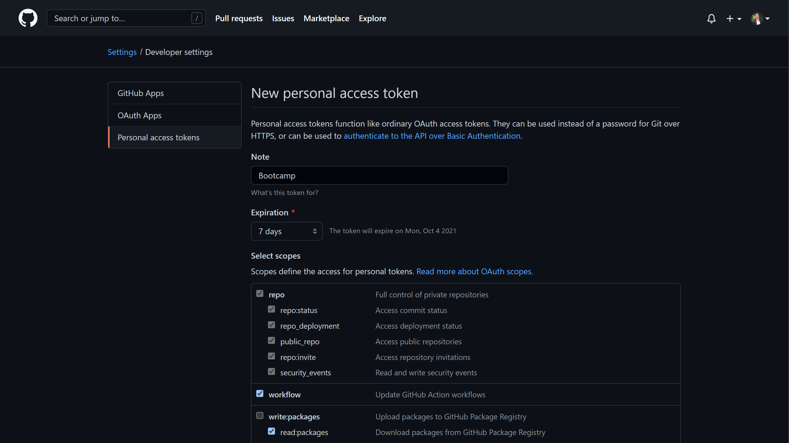

# Migrating pipelines from Azure DevOps to GitHub Actions using Valet 
In this hands-on lab you will get a first glance at the tooling that is build to migrate CI/CD solutions to GitHub actions. This tool is called **Valet**.

We will start with setting up the tools, use the tools for a dry-run and do a migration of one pipeline to Azure DevOps to get a feel on how the tools work.

All the hands-on labs will use the CodeSpaces capability of GitHub. During the import of the git repository, we more or less sneaked in the configuration for the codespaces setup. This is done because we included a folder called `.devcontainer`. This contains the setup of our development environment for this hands-on exercise.

The container needs access to the Valet tooling, which is stored in the GitHub Container Registry. These secrets are already preconfigured in at the organization level.

This hands on lab consists of the following steps:
- [Setting up your CodeSpaces development environment](#setting-up-your-codespaces-development-environment)
- [Adding Valet to your CodeSpaces development environment](#adding-valet-to-your-codespaces-development-environment)
- [Pulling the Docker image for Valet](#pulling-the-docker-image-for-valet)
- [Run an audit on the existing Azure DevOps project](#run-an-audit-on-the-existing-azure-devops-project)
- [Generate a Personal Access Token](#generate-a-personal-access-token)
- [Execute the migration](#execute-the-migration)

## Setting up your CodeSpaces development environment
Now before we continue the hands-on lab, go to your repository and start your Codespace instance by clicking the button `Code`, then the tab `Codespaces` and select `New Codespace`.


The first time you create a Codespace You will see the following screen.


Please wait for this to complete. The reason it takes some more time the first time has to do with the fact the container needs to be build for the first time. Next time you start a Codespace you will get access in a few seconds.

When your Codespace is ready you will see the full IDE appear in your browser. This is a full Visual Studio Code experience in your browser! This looks as follows:


The place where we will do all our work for this hands-on lab is in the terminal window, that you can find in the right bottom part. It should show you a command-line and it is currently in the folder `/workspaces/<your-repo-name> (main)`
  
> Note: All command-line steps assume the above environment to work. So please ensure this is the case before you start.

## Adding Valet to your CodeSpaces development environment

Valet uses a Docker container to do all the work. This container is available the moment you are onboarded to Valet.
Valet consist primarily out of two things we need to setup before we can do some work:

- A Docker image that we need on our machine
- A script `valet`, that drives the use of the Docker container on our workstation.

Let us get started by setting up the tools so they work.

### Pulling the Docker image for Valet

In the terminal window in your Codespace environment (or in Visual Studio Code if you prefer to use that)
type at the command-line:

```
docker images
```
  
This should return a list of images
  
```
codespace ➜ /workspaces/attendee-github-handle (main) $  docker images
REPOSITORY                          TAG       IMAGE ID       CREATED        SIZE
ghcr.io/valet-customers/valet-cli   latest    f4a34ec3baea   18 hours ago   141MB
```
  
The codespace you're using has already pulled the `valet-cli` image if your github user has the permissions to do so. 

If codespaces was unable to pull the image you can try to pull it manually.

You need a Personal Access Token with at least the `read:packages` and `workflow` permissions:



Then you can run:

```
$ docker login ghcr.io/valet-customers/valet-cli
Username: **your-github-handle**
Password: **your github personal access token here**
```

The expected output would be:
```
Username: <your-github-handle>
Password: *******
WARNING! Your password will be stored unencrypted in /home/codespace/.docker/config.json.
Configure a credential helper to remove this warning. See
https://docs.docker.com/engine/reference/commandline/login/#credentials-store
```

Next, we pull the image to the local Codespace 

>$ docker pull ghcr.io/valet-customers/valet-cli

The expected output would be:
```
Using default tag: latest
latest: Pulling from valet-customers/valet-cli
540db60ca938: Pull complete 
98a867505730: Pull complete 
69c77620f610: Pull complete 
9b370d66bb99: Pull complete 
d9f4ad4e4f54: Pull complete 
141b99f6eb7e: Pull complete 
c30228028dd8: Pull complete 
89a422fd482f: Pull complete 
Digest: sha256:a16b34607e98311fd6568700ed774382f63d213b36d7cbd82ec060a5e998a86a
Status: Downloaded newer image for ghcr.io/valet-customers/valet-cli:latest
ghcr.io/valet-customers/valet-cli:latest
```

Now, we want to try to create some migrations of the Azure DevOps project that you can find in the Xpirit Repository (dev.azure.com/xpirit). 
The Team project name we can use for this exercise is **TailWindTraders**.

> Note: please feel free to use your own Azure DevOps projects, the lab is more step by step prepared, feel free to go of script here!

In your terminal, change directory to the folder `valet` on your local repo in your codespaces IDE (use the command `cd valet`). This is where we have pre-created a configuration file for the migration. A script to run valet has been pre-loaded into your codespace.
  
> Note: If you're working in your own development environment, make sure you [obtain the latest version of `valet` and `valet-update`](https://github.com/valet-customers/distribution/tree/main/scripts). You may have change the permissions on these scripts to make them executable:
> ```
> chmod +x valet
> chmod +x valet-update
> ```
  
Try to run `valet`. 

It should now output the valet commands that are available:

```
Valet commands:
  valet audit                               # An audit will output a list of data used in a CI/CD instance.
  valet dry-run                             # Convert a pipeline to a GitHub Actions workflow and output it's yaml file.
  valet help [COMMAND]                      # Describe available commands or one specific command
  valet migrate                             # Convert a pipeline to a GitHub Actions workflow and open a pull request with the changes.
  valet upload-audit --audit-dir=AUDIT_DIR  # Upload the output of an audit for the Valet product team.
  valet version                             # valet version

Options:
      [--allowed-actions=one two three]                                      # An allowed list of GitHub actions to map to.
      [--allow-verified-actions], [--no-allow-verified-actions]              # Boolean value to only allow verified actions.
      [--allow-github-created-actions], [--no-allow-github-created-actions]  # Boolean value allowing only GitHub created actions.
      [--yaml-verbosity=YAML_VERBOSITY]                                      # YAML verbosity level.
                                                                             # Possible values: quiet, minimal, info
      [--custom-transformers=one two three]                                  # Paths to custom transformers.
  o, [--output-dir=OUTPUT_DIR]                                               # The location for any output files.
      [--credentials-file=CREDENTIALS_FILE]                                  # The file containing the credentials to use.
      [--no-telemetry], [--no-no-telemetry]                                  # Boolean value to disallow telemetry.
```
  
## Run an audit on the existing Azure DevOps project
  
To run Valet commands we need to pass in the arguments at each command or we can set up a file called `.env.local`. We provided this file already in the Valet folder. It is most convenient to use this file and only fill in the missing details for Azure DevOps and for GitHub. 
  
Add the following parameters to the file:
  
```
AZURE_DEVOPS_PROJECT=TailWindTraders
AZURE_DEVOPS_ORGANIZATION=xpirit
AZURE_DEVOPS_INSTANCE_URL=https://dev.azure.com/xpirit
```

> NOTE: Normally you'd also add a Personal Access Token for Azure DevOps, but in this hands-on lab that token is automatically picked up from the environment.
> ]
> ```
> AZURE_DEVOPS_ACCESS_TOKEN=xxxxxxxxxxxxxxxxxxxxxxxxxxxxxxxxxxxxxxxxxxxxxxxxxx
> ```

Now, from the `./valet` folder in your repository, run valet to verify your Azure DevOps configuration:
  
```
cd valet
valet audit azure-devops --output-dir . 
```

This will run the tool with the options you specified in the `.env.local` file.

The output of this audit run will result in a set of files that got generated to become the future action workflows and a summary page that contains the output of the audit. 
Here you can see how the migration will happen and how successful it will be. Note that not everything will be migrated and manual fixes are needed to succeed.
 
Inspect the file `audit_summary.md` and look at the results of the audit migration

# Generate a Personal Access Token
Before we move to the step where we execute the migration, you first need to generate a Personal Access Token. 
1. To do so, navigate to your GitHub Settings - click your profile photo and go to Settings or follow [this link](https://github.com/settings/profile).
2. Go to `Developer Settings`
3. Go to `Personal Access Tokens`
4. Click `Generate new token`. If required, provide your password.
5. Select at least the scopes `read packages` and `workflow`. Optionally, provide a text in the field `Note` and change the `Expiration`. 
6. Click `Generate token`
7. Your token is now generated. Make sure to copy your token, as you will not be able to retrieve it later on. Move to the next step ([Execute the migration](#execute-the-migration)) where you will use this token.
  
# Execute the migration
  
Now we are going to migrate one of the successful pipelines. 
For this we need to make changes to the `.env.local.` file or pass in the arguments at the command line. 
Make changes to the `.env.local.` file and add the following parameters to the file:
  
```
GITHUB_ACCESS_TOKEN=<your github token here>
GITHUB_INSTANCE_URL=https://github.com
```

Now, we can run the command line and need to pass it the pipeline command. This command also requires to pass in a --target-url, which is the GitHub repo you are targeting. This is the location `https://github.com/Microsoft-Bootcamp/<your-repo-name>`.  
You also need the pipeline id of the Azure DevOps pipeline. You can find this in the URL of the Azure DevOps project the moment you browse to the pipeline details. Refer to the screenshot below where to find it:
  


Then we can run the following command to execute the migration:
> valet migrate azure-devops pipeline --target-url https://github.com/Microsoft-Bootcamp/your-repo-name; --pipeline-id ###number from AzDo pipeline###

You will find the following results:
  
```
[2021-09-14 11:45:04] Logs: 'log/valet-20210914-114504.log'                                                                                     
WARNING: `Faraday::Connection#basic_auth` is deprecated; it will be removed in version 2.0.                                                     
While initializing your connection, use `#request(:basic_auth, ...)` instead.
See https://lostisland.github.io/faraday/middleware/authentication for more usage info.
WARNING: `Faraday::Connection#authorization` is deprecated; it will be removed in version 2.0.                                                  
While initializing your connection, use `#request(:authorization, ...)` instead.
See https://lostisland.github.io/faraday/middleware/authentication for more usage info.
[2021-09-14 11:45:08] Pull request: 'https://github.com/Microsoft-Bootcamp/your-repo/pull/xxx' 
 ```

The last line shows you a pull request that got created on the target repository that contains the migrated workflow.
This will look as follows:


Now, inspect the pull request and the action workflow that is part of the pull request.
Accept the pull request and run the workflow manually.

The result of the action workflow is a successful build that creates a set of artifacts that can be used to run a deployment workflow and pick up the artifacts.
  
